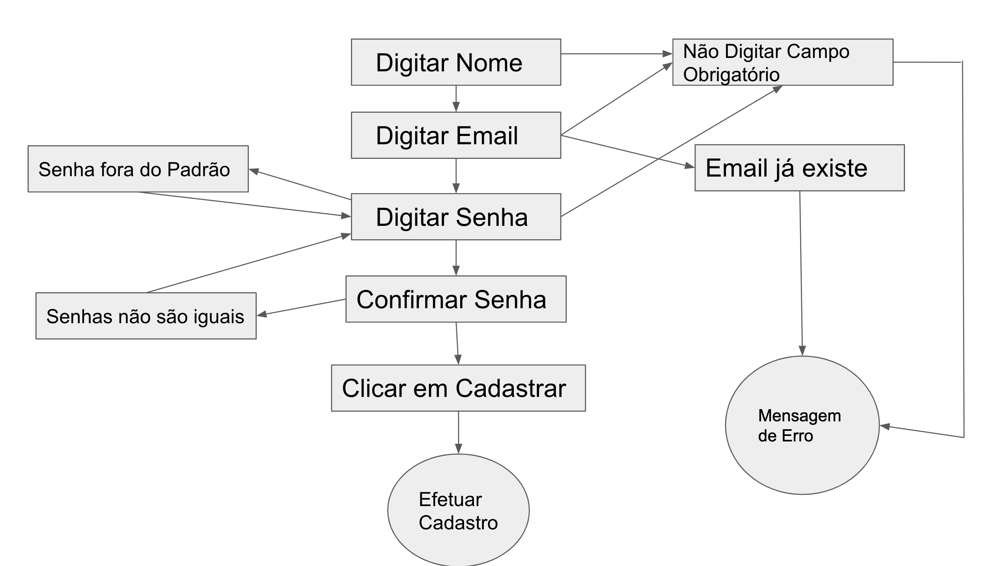
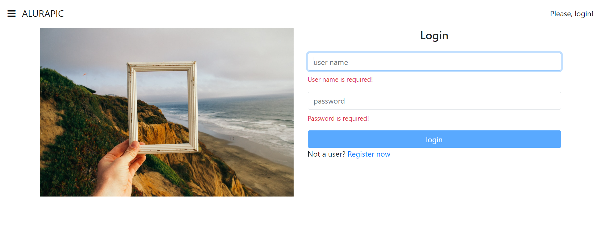
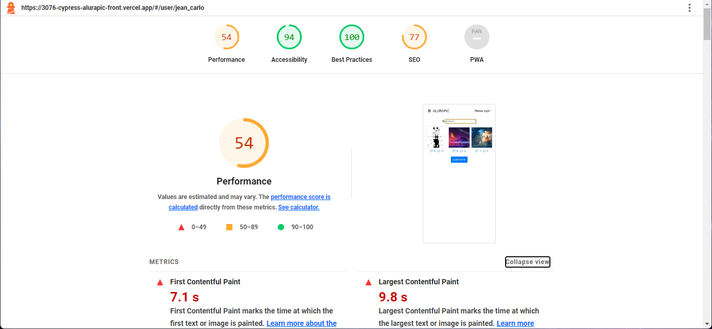

# AluraPic - Plano de testes e gestão de bugs

Projeto Realizado durante o curso de <b>Quality Assurance: plano de testes e gestão de bugs</b> da Alura. Onde a ideia é criar um plano de teste, documento de planejamento de teste de software e a gestão de bugs no sistema.

https://3076-cypress-alurapic-front.vercel.app/

* Os documentos de testes estão nos arquivos desse repositorio.

 

### Diagrama 

* Utilizado para a estrutura de uso do sistema
   
  
### Alurapic - Página Login 

 

### Alurapic - Página Principal 

 

### Teste de Performance 

* Teste de Performance, feito utilizando a extensão LightHouse.

 ## Tópicos abordados durante esse projeto.

* Criar um plano de teste, documento de planejamento de teste de software
* O que são testes, como modelá-los e executá-los
* Encontrar e reportar defeitos em sistemas
* Descubra o papel do profissional de qualidade de software em um time de desenvolvimento
* Entenda o que são cenários e casos de teste
* Como metrificar a qualidade do seu software
  

 

<h3>Contribuindo</h3>

⭐️ Star o projeto

🐛 Encontrar e relatar issues
